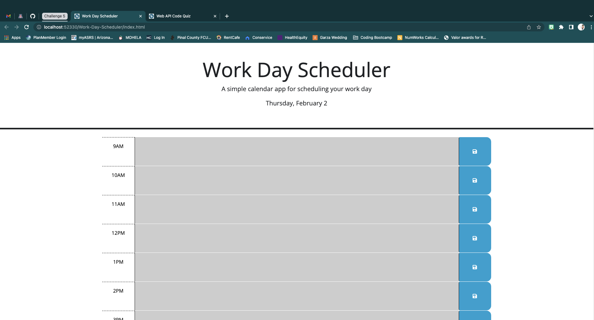

# Work-Day-Sceduler

## Description
This is a modified starter code that creates a simple calendar application that allows a user to save events for each hour of the day.

## Links

[GitHub Repo](https://github.com/jeannav/Work-Day-Scheduler)\
[Live URL](https://jeannav.github.io/Work-Day-Scheduler/)

